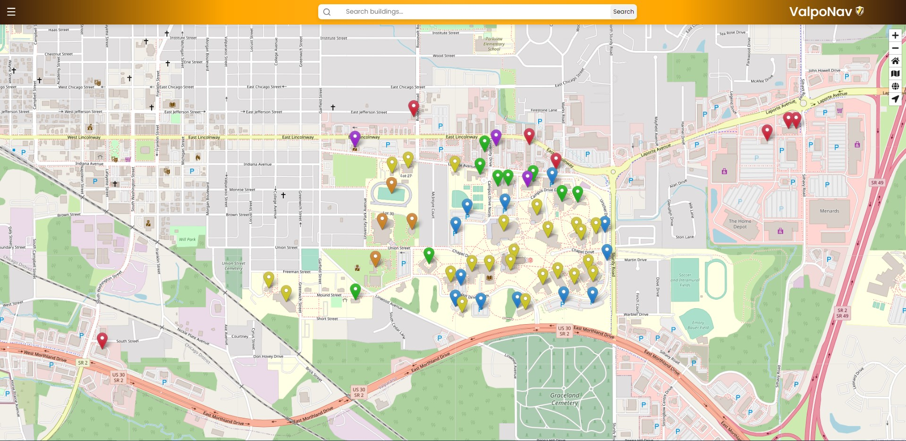

# ValpoNav

A navigation tool created to Valparaiso University visitors find building locations and their contents. 

Written as CS-495 Independent Study by Justin, JJ and Charlie. 

## Getting Started

These instructions will get you a copy of the project up and running on your local machine for development and testing purposes. See deployment for notes on how to deploy the project on a live system.

### Inspiration

At Valparaiso University, students face many obstacles, but the least of a student's worries should be navigation. 
Navigating a new campus can be confusing, and challenging for both first year students and upperclassmen. 
Even visitors may have a hard time navigating the campus environment. In response to this issue, we 
have decided to develop a navigation application that has an interactive campus map and allows 
users to locate buildings and their existing rooms with the corresponding room number. 
This website will be able to be utilized by any student, staff, or visitor which 
would eliminate the confusion and worries. This software has been developed in 
HTML/CSS for the user interfaces which utilize PHP, Javascript, and React.js 
for functional purposes and database management for our software.


## Usage

A few examples of useful features.

<p align="center">
  
</p>

```
$ Search Button --> allows users to search for specific buildings. 
$ Home Button --> allows users to re-center view of the map for original view.
$ Navigation Button --> allows users to find their exact location so that they can see where they are on campus
$ Zoom Buttons --> allows users to zoom in and zoom out of the map for larger or smaller field of view.
```


## Additional Documentation and Acknowledgments

*  [Justin](https://github.com/jklayhew) - Software Developer
*  [JJ](https://github.com/jjohn120) - Software Developer
*  [Charlie](https://github.com/charliemalach) - Software Developer
